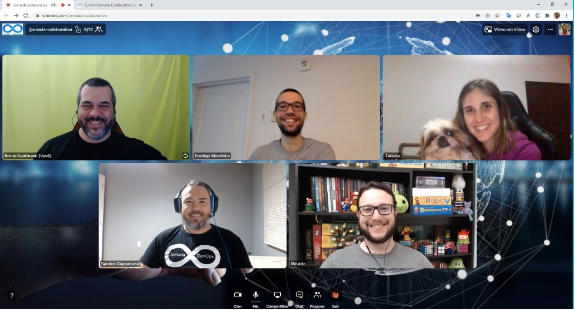

# Livro Jornada Java

* [Sobre o repositório](#sobre-o-repositório)
  * [Requisitos exemplos](#requisitos-exemplos)
  * [Como utilizar o projeto](#como-utilizar-o-projeto)
  * [Executando os exemplos](#executando-os-exemplos)
* [Sumário](#sumário)
* [Autores](#autores)
* [Colaboradores](#colaboradores)

# Sobre o repositório

Neste repositório você encontrará todas as informações adicionais relacionadas ao livro. Código fonte e tutoriais
 complementares ao livro Jornada Java.

## Requisitos exemplos

A seguir, os requisitos para executar todos os projetos do livro.

* [Java 11](https://adoptopenjdk.net/) ou superior, sendo que em alguns exemplos será necessário o Java 14
* [Maven 3.5.4](https://maven.apache.org/download.cgi) ou superior
* [Docker 19.03.5](https://docs.docker.com/engine/install/) ou superior
* [Git](https://git-scm.com/downloads)

## Como utilizar o projeto

Para obter os exemplos de código do Github, execute:

```
git clone https://github.com/jornada-java/livro.git
```

Para compilar os projetos, basta ir ao diretório raiz e executar `mvn clean install` no console.

## Executando os exemplos

Dependendo da IDE que está utilizando, basta ir em cada classe Main do projeto ou classe de Teste e executar. Alguns
 exemplos possuem dependências externas tais como banco de dados. Neste caso será explicado como inicializar estas dependências.

## Instalando as ferramentas

* Java 14 Windows (https://youtu.be/EAOms5JkfT8)

# Sumário

* Parte I - Porque desenvolver software usando Java?
* Parte II - Introdução ao Java
* [Parte III - Java Básico](./parte-03)
* [Parte IV - Orientação a Objetos em Java](./parte-04)
* [Parte V - Novos recursos da linguagem](./parte-05)
* [Parte VI - Banco de Dados](./parte-06)
* [Parte VII - Tópicos Avançados](./parte-07)
* [Parte VIII - Testes](./parte-08)
* [Parte IX - Gestão de Configurações e Ferramentas de Aplicação](./parte-09)
* [Parte X - Fundamentos de desenvolvimento de Java para Web](./parte-10)
* [Parte XI - Tópicos avançados para o desenvolvimento Web](./parte-11)
* [Parte XII - Segurança de Aplicações](./parte-12)
* [Parte XIII - Cloud e Deploy](./parte-13)

# Autores

* Antônio Muniz
[[Linkedin 1]](https://www.linkedin.com/in/muniz-antonio1/)
[[Linkedin 2]](https://www.linkedin.com/in/muniz-antonio2/)
[[Contato]](munizprofessor@gmail.com)
* Bruno Kaufmann
[[Linkedin]](https://www.linkedin.com/in/bruno-kaufmann/)
* Rinaldo Pitzer Júnior
[[Linkedin]](https://www.linkedin.com/in/rinaldodev/)
* Rodrigo Moutinho
[[Linkedin]](https://www.linkedin.com/in/rcmoutinho/)
[[Twitter]](https://twitter.com/rcmoutinho)
[[GitHub]](https://github.com/rcmoutinho)
[[Site]](https://cyborgdeveloper.tech/)
* Sandro Luciano Giacomozzi
[[Linkedin]](https://www.linkedin.com/in/sandrogiacomozzi/)
[[About.me]](https://about.me/sandrogiacom)
[[Site]](https://www.guiadojava.com.br/)
* Tatiana Escovedo
[[Linkedin]](https://www.linkedin.com/in/tatiana-escovedo/)


_Autores no evento Jornada Java em 2020_

# Colaboradores

* Alisson Medeiros
[[Linkedin]](https://www.linkedin.com/in/alisson-medeiros-8bb67830/)
* Allan Rodrigo Leite
[[Linkedin]](https://www.linkedin.com/in/allan-rodrigo-leite-67b34252/)
* André Felipe Joriatti
[[Linkedin]](https://www.linkedin.com/in/joriatti)
* Bárbara Cabral da Conceição
[[Linkedin]](https://www.linkedin.com/in/barbaracabral/)
* Bruno Souza
[[Linkedin]](https://www.linkedin.com/in/brjavaman/)
* Diego de Medeiros Rocha
[[Linkedin]](https://www.linkedin.com/in/diego-rocha/)
* Dorival Querino
[[Linkedin]](https://www.linkedin.com/in/dorivalq/)
* Edson Yanaga
[[Linkedin]](https://www.linkedin.com/in/yanaga/)
* Eduardo Costa
[[Linkedin]](https://www.linkedin.com/in/educostadev/)
* Fábio Braga
[[Linkedin]](https://www.linkedin.com/in/fabio-braga-85080624/)
* Gabriela Moraes
[[Linkedin]](https://www.linkedin.com/in/gabrielaomoraes/)
* Jonas Santos
[[Linkedin]](https://www.linkedin.com/in/jonasvsantos/)
* Kamila Santos
[[Linkedin]](https://www.linkedin.com/in/kamila-santos-oliveira/)
* Leonardo de Moura Rocha Lima
[[Linkedin]](https://www.linkedin.com/in/leomrlima/)
* Luca Fenris Elert
[[Linkedin]](https://www.linkedin.com/in/lucaElert/)
* Marcelo Henrique Diniz de Araujo
[[Linkedin]](https://www.linkedin.com/in/marcelo-hda/)
* Marcos Paulo
[[Linkedin]](https://www.linkedin.com/in/marcospds/)
* Otavio Santana
[[Linkedin]](https://www.linkedin.com/in/otaviojava/)
* Rafael Buzzi de Andrade
[[Linkedin]](https://www.linkedin.com/in/rafaelbuzzi/)
* Raphael Vitorino da Silva
[[Linkedin]](https://www.linkedin.com/in/raphael-vitorino-da-silva-12910781/)
* Rhuan Henrique
[[Linkedin]](https://www.linkedin.com/in/rhuan-rocha-96505870/)
* Roan Brasil Monteiro
[[Linkedin]](https://www.linkedin.com/in/roanbrasil/)
[[Twitter]](https://twitter.com/roanbrasil)
[[GitHub]](http://github.com/roanbrasil)
* Rodrigo Sobral
[[Linkedin]](https://www.linkedin.com/in/rodrigo-sobral-64092886/)
* Silvio Buss
[[Linkedin]](https://www.linkedin.com/in/silviobuss/)
* Vitor Vieira
[[Linkedin]](https://www.linkedin.com/in/vitor-araujo-3678b498/)
* Zair Ramos
[[Linkedin]](https://www.linkedin.com/in/ZairRamos)
