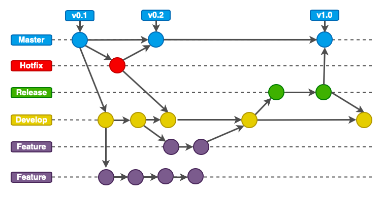
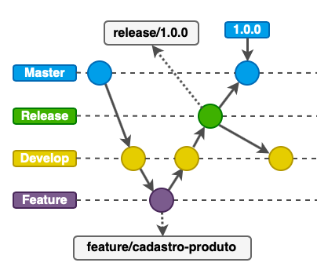
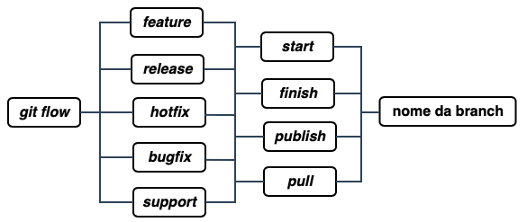

# Capítulo 55 - Git flow
*Jonas Santos*

[Git Flow]: (https://www.atlassian.com/git/tutorials/comparing-workflows/gitflow-workflow)

* [Fluxo de Trabalho com o Git](#fluxo-de-trabalho-com-o-git)
* [Instalação do Plugin](#instalação-do-plugin)
* [Utilizando o Git Flow](#utilizando-o-git-flow)
  * [Inicializando o Git Flow](#inicializando-o-git-flow)
  * [Criando uma Feature Branch](#criando-uma-feature-branch)
  * [Finalizando a Feature Branch](#finalizando-a-feature-branch)
  * [Iniciando um Release](#iniciando-um-release)
  * [Finalizando um Release](#finalizando-um-release)
* [Resumo dos Comandos](#resumo-dos-comandos)

## Fluxo de Trabalho com o Git

Se você já trabalhou em mais de uma empresa que utiliza Git como ferramenta de versionamento de código, já pode ter reparado que nem sempre os padrões adotados de fluxo de trabalho e nomenclatura de *branches* são os mesmos.

Agora se você é novo nessa jornada Git, este capítulo irá te ajudar bastante a compreender como a maioria das empresas costumam utilizar seus fluxos de *branches* e trabalho.
 
E é claro, se você trabalha em uma empresa que utiliza Git e não tem um fluxo de trabalho definido, que tal se aprofundar e levar este conceito para sua empresa?

Em projetos pessoais, é comum vermos o desenvolvedor trabalhando em apenas uma *branch*. Mas no mundo corporativo quando trabalhamos em equipe com vários desenvolvedores, este cenário muda completamente.
 
Por isso é muito importante que tenhamos um controle do fluxo do que está sendo produzido pelas equipes, onde, em paralelo estão implementando novas funcionalidades, melhorias e correções de bugs.

Podemos dizer que de forma ampla existem alguns possíveis modelos de fluxos de trabalho, dentre eles:

* **Centralizado:** Um repositório e os commits são feitos diretamente na master.
* ***Branches* de funcionalidade**: Um repositório e *branches* específicas são criadas, e posteriormente, mescladas com a master.
* **Bifurcado:** Mais de um repositório remoto. Um deles é definido como o principal. Commits em *branches* específicas. Uma pessoa ou equipe responsável pelos merges na repositório principal.

O [Git Flow] é um plugin com a evolução desses modelos, e entra nessa jogada para nos ajudar, proporcionando um modelo de fluxo para organizar nosso trabalho, dentre eles, padrões de nomenclaturas de *branches*, tags e funções para cada tipo de branch.

Vale lembrar, que o Git Flow não é o único modelo de fluxo de trabalho que podemos seguir. Outro ponto também, é que o Git Flow não é um conjunto de regras, e sim orientações, ou seja, não precisa seguir 100% seu modelo. Ele pode ser adaptado para cada equipe e empresa.

Para compreendermos melhor, vejamos a imagem a seguir:

  
Figura 55.1: Fluxo de trabalho Git Flow *(Fonte: Adaptado de https://nvie.com/)*

De acordo com a imagem, perceba que o modelo de fluxo apresentado é da esquerda para direita. O [Git Flow] aborda as seguintes nomenclaturas de branches ([mais]( https://nvie.com/posts/a-successful-git-branching-model/)): *master*, *hotfix*, *release*, *develop* e *feature*.

Vamos ao conceito de cada uma:

* ***master***: é a *branch* que contém o código de produção, usa-se tags para marcar as atualizações, por exemplo: `1.0`.
* ***develop***: é a *branch* de desenvolvimento que contém o código da próxima entrega, ou seja, conforme as features são finalizadas, elas vão sendo mescladas nesta *branch* develop. Em seguida, passa por mais uma etapa e estando tudo certo vai para a master. Esta *branch* é gerada na inicialização do [Git Flow].
* ***feature/\****: são *branches* criadas para o desenvolvimento de uma nova funcionalidade. Sempre são criadas à partir da *branch* develop e posteriormente mesclada também para a develop. Seus nomes se iniciam com `feature/`, por exemplo: `feature/cadastro-produto`.
* ***hotfix/\****: são *branches* responsáveis por correções críticas em produção que não podem esperar pela próxima entrega (release). Por isso são criadas à partir da master, e após correção, essas *branches* são mescladas na master e develop. Seus nomes se iniciam com `hotfix/`, por exemplo: `hotfix/correcao-cadastro-cliente`.
* ***release/\****: são *branches* em preparação para uma nova entrega que entraram em homologação. São criadas à partir da develop e seus nomes se iniciam com `release/`, por exemplo: `release/v1.0`.

O [Git Flow], por padrão, sempre que uma *branch* `hotfix/` ou `release/` é mesclada com a *master*, as tags são automaticamente geradas facilitando uma mudança para uma versão mais antiga.

## Instalação do Plugin

Por se tratar de um *plugin*, o [Git Flow] não é uma ferramenta padrão do Git. Por isso precisamos instalar o *plugin* em nossa máquina local.

Para instalar, acesse a [*wiki* do repositório](https://github.com/nvie/gitflow/wiki/Installation) e consulte as instruções de acordo com o sistema operacional.

## Utilizando o Git Flow

Após a instalação, vamos seguir com alguns exemplos práticos.

### Inicializando o Git Flow

Partindo do príncipio que já estamos no diretório onde se encontra um projeto versionado com Git, inicialize o [Git Flow] com o comando a seguir:

```
git flow init
```

Como citado anteriormente, não é preciso seguir 100% a fundo o [Git Flow]. Após executarmos o comando anterior, serão feitas algumas perguntas a respeito de nomenclaturas. Vamos utilizar o padrão teclando *ENTER* para cada pergunta. A saída será algo parecido com: 

```
jornada-java git:(master) git flow init

Which branch should be used for bringing forth production releases?
   - master
Branch name for production releases: [master]
Branch name for "next release" development: [develop]

How to name your supporting branch prefixes?
Feature branches? [feature/]
Bugfix branches? [bugfix/]
Release branches? [release/]
Hotfix branches? [hotfix/]
Support branches? [support/]
Version tag prefix? []

jornada-java git:(develop)
```

Perceba que após rodar o comando, a *branch* foi criada e foi realizado o *checkout* para a *branch develop*.

Na saída também podemos ver sugestões de *branches* com a nomenclatura `bugfix/` e `support/`. São nomenclaturas que estão em beta, não iremos abordá-las. Mas os comandos que iremos ver, também irão funcionar para as mesmas. 

### Criando uma Feature Branch

Suponhamos que iremos criar uma funcionalidade de cadastro de produtos. Bastaria iniciar uma *feature branch* como proposto no comando a seguir:

```
git flow feature start cadastro-produto
```

Observe a saída do console após a execução do comando:

```
jornada-java git:(develop) git flow feature start cadastro-produto
Switched to a new branch 'feature/cadastro-produto'

Summary of actions:
- A new branch 'feature/cadastro-produto' was created, based on 'develop'
- You are now on branch 'feature/cadastro-produto'

Now, start committing on your feature. When done, use:

     git flow feature finish cadastro-produto

jornada-java git:(feature/cadastro-produto)
```

O [Git Flow], tem um comando específico para enviar as branches ao repositório remoto. Mas o comando padrão `git push <nome_da_branch>` continua funcionando normalmente. O comando a seguir apenas simplifica o processo:

```
git flow feature publish cadastro-produto 
```

### Finalizando a Feature Branch

Ainda usando nosso exemplo da funcionalidade de cadastro de produtos, após finalizarmos a tarefa, ou seja, ter criado os *commits* e realizado o *push*, precisamos finalizar a *branch* e mesclar com a *branch develop*. Veja a seguir como seria o comando para este cenário:

```
git flow feature finish cadastro-produto
```

Observe a saída do console após a execução do comando:

```
jornada-java git:(feature/cadastro-produto) git flow feature finish cadastro-produto
Switched to branch 'develop'
Updating e0a8338..85c1f68
Fast-forward
 cadastro-produto.html | 0
 1 file changed, 0 insertions(+), 0 deletions(-)
 create mode 100644 cadastro-produto.js
Deleted branch feature/cadastro-produto (was 85c1f68).

Summary of actions:
- The feature branch 'feature/cadastro-produto' was merged into 'develop'
- Feature branch 'feature/cadastro-produto' has been locally deleted
- You are now on branch 'develop'

jornada-java git:(develop)
```

Após a execução do comando, a `feature/cadastro-produto` já foi deletada e mesclada com a *branch develop*, e o checkout para a *branch develop* também já foi realizado. 

### Iniciando um Release

Agora que nossa funcionalidade de cadastro de produtos já está na *branch develop*, precisamos iniciar um *release* para ser entregue. Veja a seguir o comando para iniciar a *release*:

```
git flow release start 1.0.0
```

Saída do console após a execução do comando:

```
jornada-java git:(develop) git flow release start 1.0.0
Switched to a new branch 'release/1.0.0'

Summary of actions:
- A new branch 'release/1.0.0' was created, based on 'develop'
- You are now on branch 'release/1.0.0'

Follow-up actions:
- Bump the version number now!
- Start committing last-minute fixes in preparing your release
- When done, run:

     git flow release finish '1.0.0'

jornada-java git:(release/1.0.0)
```

Agora já temos um *release* para entrar em fase de testes, como por exemplo a fase de homologação. Vale lembrar, que nesse processo a *branch* pode sofrer algumas alterações devido aos testes finais.

Ao  inicializar ou antes de finalizar uma *branch*, não esqueça de enviá-la ao repositório. É sempre bom mantermos as *branches* sincronizadas com o servidor remoto.

### Finalizando um Release

Depois de passar na fase de testes, vamos finalizar nosso *release*. Este processo é feito com o seguinte comando:

```
git flow release finish 1.0.0
```

O processo de finalização de *release* é um pouco diferente. O [Git Flow] abre o editor de texto para que possamos editar alguns detalhes:

* Primeiro: o texto *(opcional)* do commit do merge, com relação entre a branch *release* e a *master*.
* Segundo: a descrição *(obrigatória)* da tag que será gerada pelo [Git Flow] para facilitar a mudança de versão.
* Terceiro: o texto *(opcional)* do commit do merge, com relação entre a *branch master* e a *develop*.

Observe a saída do console após a execução do comando:

```
jornada-java git:(release/1.0.0) git flow release finish 1.0.0
Switched to branch 'master'
Your branch is up-to-date with 'origin/master'.
Merge made by the 'recursive' strategy.
 cadastro-produto.html | 0
 1 file changed, 0 insertions(+), 0 deletions(-)
 create mode 100644 cadastro-produto.html
Switched to branch 'develop'
Already up-to-date!
Merge made by the 'recursive' strategy.
Deleted branch release/1.0.0 (was 85c1f68).

Summary of actions:
- Release branch 'release/1.0.0' has been merged into 'master'
- The release was tagged '1.0.0'
- Release tag '1.0.0' has been back-merged into 'develop'
- Release branch 'release/1.0.0' has been locally deleted
- You are now on branch 'develop'

jornada-java git:(develop)
```

Com esta etapa concluída, as alterações já estão atualizadas nos *branches master* e *develop*.

Para verificar a *tag* gerada, execute o comando a seguir:

```
git show 1.0.0
```

A seguir o comando para enviar a *tag* ao repositório remoto:

```
git push origin 1.0.0
```

No nosso exemplo, o fluxo ficou conforme a imagem a seguir:

  
Figura 55.2: Fluxo de trabalho usado no exemplo anterior


Este foi um exemplo simples do fluxo usando o [Git Flow]. Nem todo cenário é tão simples como esse apresentado. No dia a dia trabalhando em equipe, conflitos entre branches vão aparecendo. Em um cenário ideal, o fluxo seria este.

## Resumo dos Comandos

  
Figura 55.3: Resumo dos comandos

Como vimos, o [Git Flow] tem um padrão de comandos que facilita o gerenciamento do ciclo de vida do nosso fluxo de trabalho. Observe na imagem 55.3 um resumo dos comandos existentes para: *feature*, *release*, *hotfix*, *bugfix* e *support*.
