# Capítulo 64 - Tutorial: Nossa Primeira Aplicação Web

Neste tutorial, você aprenderá como criar e executar nossa aplicação de vinhos. Os exemplos serão apresentados usando a IDE Eclipse, mas você pode usar a IDE da sua preferência.

Você pode fazer download do Eclipse em https://www.eclipse.org/downloads/packages/. A versão que precisamos para trabalhar com aplicações web é a **Eclipse IDE for Java Enterprise Developers**. Selecione a versão apropriada de acordo com seu sistema operacional. 

Você também precisará instalar o *software* **Tomcat**, nosso **Container**. Para tal, acesse https://tomcat.apache.org/download-90.cgi e baixe a versão .zip do Tomcat, que permite a integração com o Eclipse. Descompacte o `.zip` para alguma pasta do seu computador.

Abra o Eclipse e configure o Tomcat clicando na aba **Servers** e em seguida no link ilustrado pela figura a seguir:

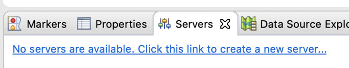  
Figura 64.1: Aba Servers

Na tela que será exibida, localize a opção **Tomcat v9.0 Server**, dentro da pasta **Apache**, e em seguida, clique no botão **Next**:

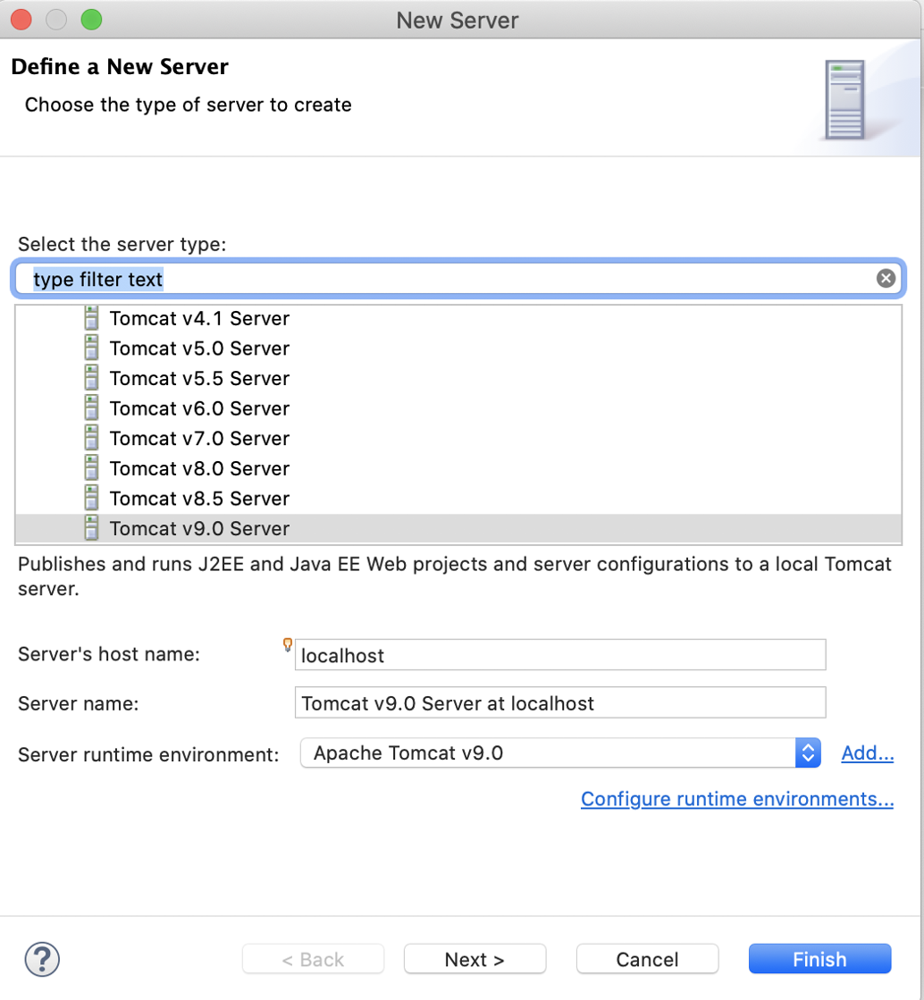  
Figura 64.2: Configuração do Tomcat

Na tela seguinte, selecione em **Tomcat installation directory** a pasta raiz do Tomcat (que estará dentro da pasta onde você descompactou o `.zip` do Tomcat) e clique no botão **Finish**:

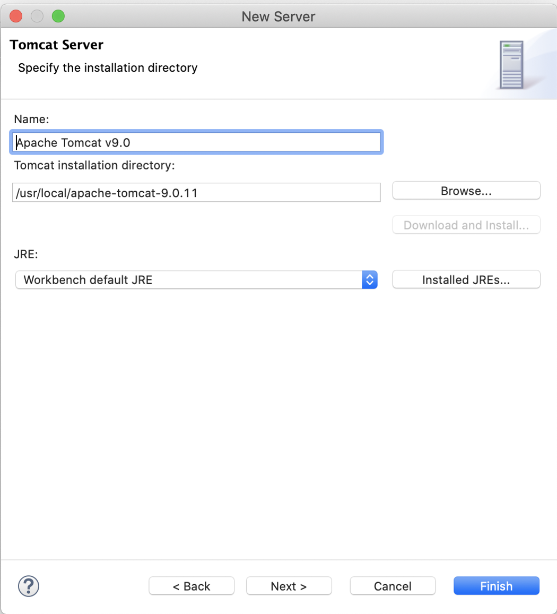  
Figura 64.3: Configuração do Tomcat

Você verá que seu servidor Tomcat foi configurado com sucesso, na aba **Servers**:

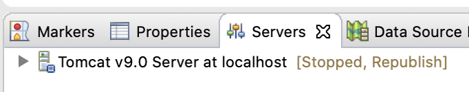  
Figura 64.4: Aba Servers

O próximo passo é criar o projeto no Eclipse. Para projetos *web*, utilizamos o tipo **Dynamic Web Project**, que pode ser criado através do menu **File > New > Dynamic Web Project**, como ilustra a figura a seguir:

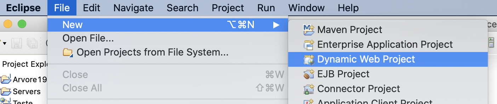  
Figura 64.5: Executando o projeto

Preencha o nome do projeto (nós usamos o nome `SisAdega`) e observe que o target runtime selecionado é o que acabamos de criar, **Apache Tomcat v9.0**. Em seguida, clique no botão **Finish**:

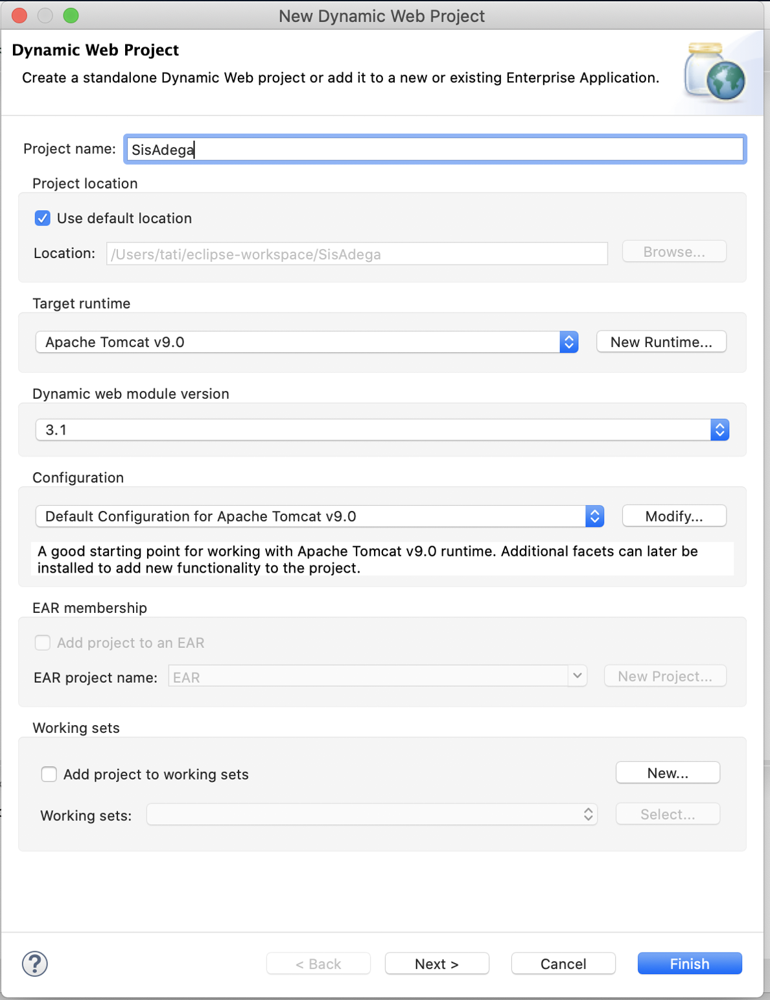  
Figura 64.6: Executando o projeto

Crie agora o nosso `index.jsp`, a primeira página da nossa aplicação. Para tal, clique na opção **New > JSP File**:

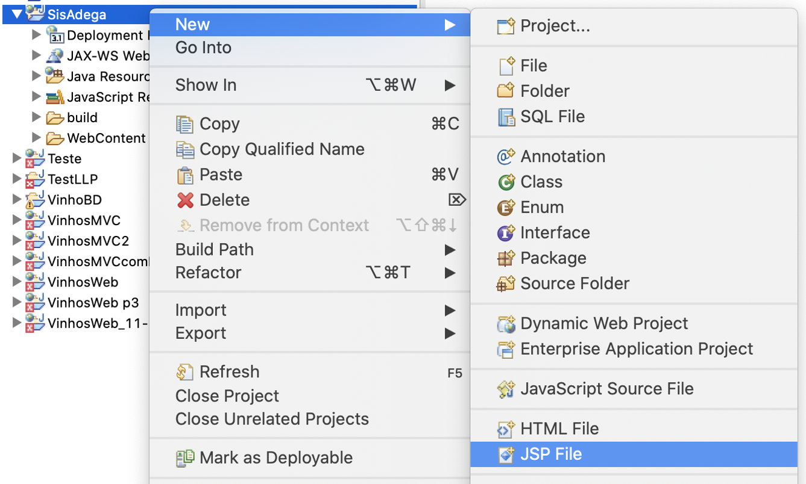  
Figura 64.7: Criando um JSP

Preencha o **File** name com `index.jsp` e clique no botão **Finish**:

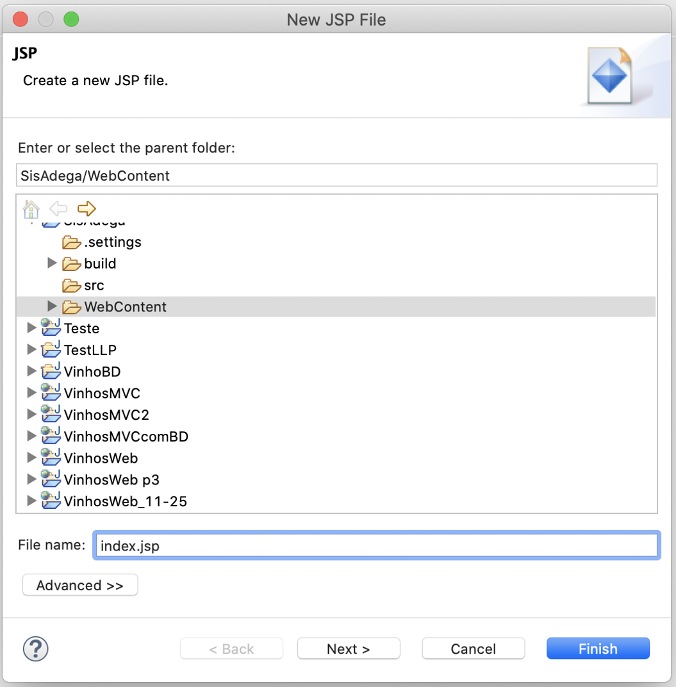  
Figura 64.8: Define um nome para o JSP

Preencha o `index.jsp` com o código a seguir, idêntico ao código já apresentado no capítulo anterior:

```html
<%@ page language="java" contentType="text/html; charset=UTF-8"
    pageEncoding="UTF-8"%>
<html>
<head>
  <meta http-equiv="Content-Type" content="text/html; charset=UTF-8">
  <title>SisAdega 1.0</title>
</head>
<body>
  <h1 align="center">Página de Seleção de Vinhos</h1>

  <form method="post" action="SelecionarVinhos">

    <p>Selecione o tipo do vinho:</p>

    <p>Tipo:</p>
    <select name="tipo" size="1">
      <option value="branco">Branco</option>
      <option value="tinto">Tinto</option>
      <option value="rose">Rose</option>
    </select>
    <br>
    <br>
    <input type="submit" value="Consultar">
  </form>
</body>
</html>
```

Em seguida, crie o **Servlet**, através da opção **New > Servlet**:

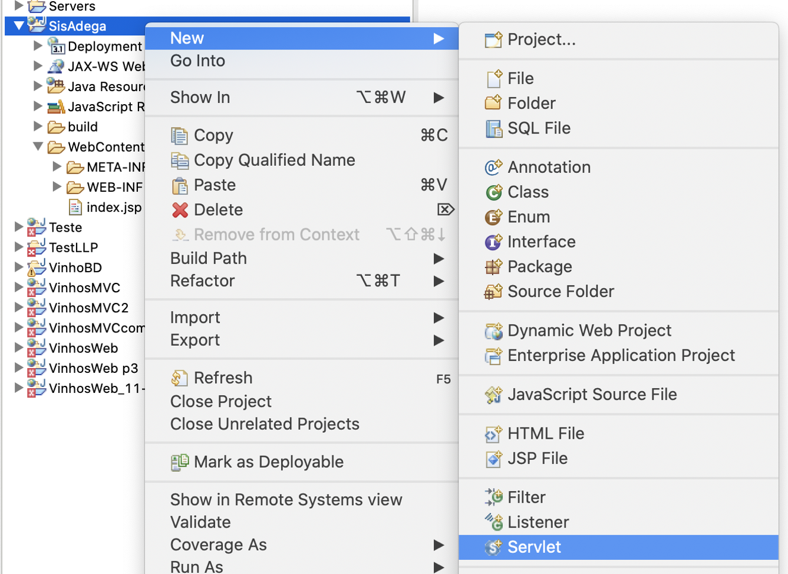  
Figura 64.9: Criando um Servlet

Preencha o **Class name** com `SelecionarVinhosServlet` e clique no botão **Finish**:

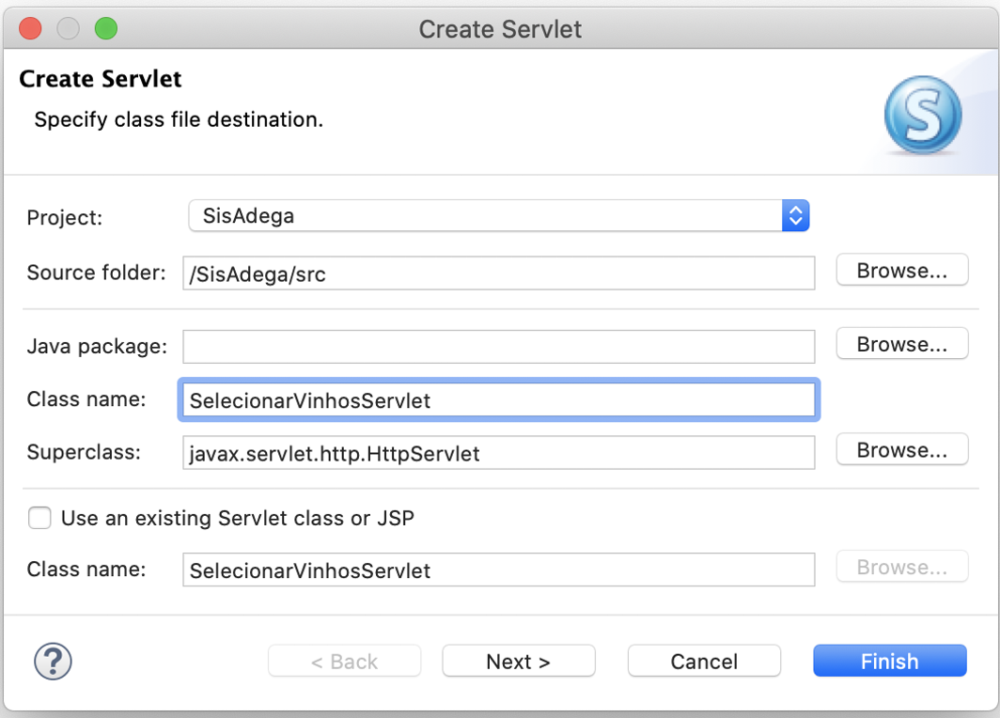  
Figura 64.10: Criando um Servlet

Preencha o `SelecionarVinhosServlet.java` com o código a seguir, idêntico ao código da última versão do Servlet já apresentado no capítulo anterior:

```java
import java.io.IOException;
import java.util.ArrayList;
import java.util.List;
import javax.servlet.RequestDispatcher;
import javax.servlet.ServletException;
import javax.servlet.annotation.WebServlet;
import javax.servlet.http.HttpServlet;
import javax.servlet.http.HttpServletRequest;
import javax.servlet.http.HttpServletResponse;

@WebServlet("/SelecionarVinhos")
public class SelecionarVinhosServlet extends HttpServlet {

  protected void doPost(HttpServletRequest request, HttpServletResponse response)
      throws ServletException, IOException {

    String tipo = request.getParameter("tipo");
    request.setAttribute("tipo", tipo);

    VinhoManager vm = new VinhoManager();
    List<?> resultado = vm.selecionarVinhosPorTipo(tipo);
    request.setAttribute("vinhos", resultado);

    RequestDispatcher view = request.getRequestDispatcher("resultado.jsp");
    view.forward(request, response);
  }
}
```

Crie então a classe de modelo, através da opção **New > Class**:

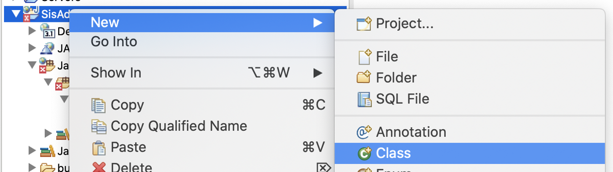  
Figura 64.11: Criando a classe Manager

Preencha o **Name** com `VinhoManager` e clique no botão **Finish**:

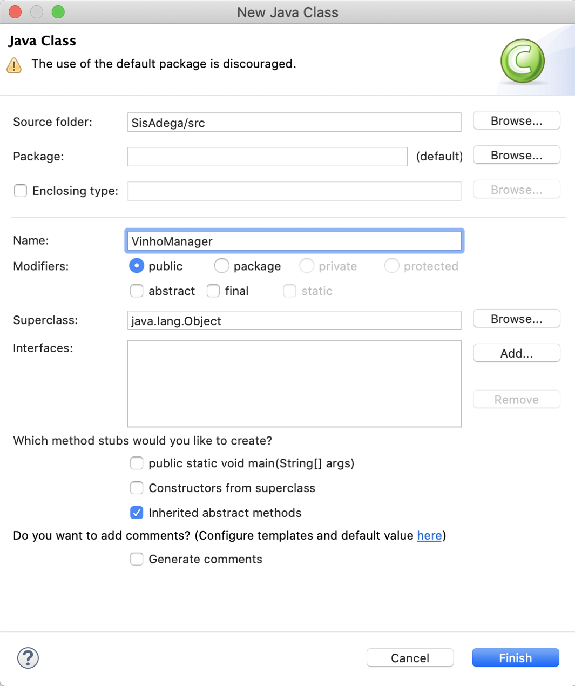  
Figura 64.12: Criando a classe Manager

Preencha o `VinhoManager.java` com o código a seguir, idêntico ao código já apresentado no capítulo anterior:

```java
import java.util.ArrayList;
import java.util.List;

public class VinhoManager {
  
  public List<String> selecionarVinhosPorTipo(String tipo) {
    
    List<String> vinhos = new ArrayList<String>();

    if ( tipo.equals("branco") ) {
      vinhos.add("Chardonnay");
      vinhos.add("Sauvignon Blanc");

    } else if ( tipo.equals("tinto") ) {
      vinhos.add("Brunello di Montalcino");
      vinhos.add("Cabernet Sauvignon Santa Helena");

    } else if ( tipo.equals("rose") ) {
      vinhos.add("Casillero Del Diablo Rosé");
      vinhos.add("Casa Valduga Naturelle Rosé");
    }

    return vinhos;
  }
}
```

Finalmente, crie o `resultado.jsp`, de forma idêntica que você criou o `index.jsp`. Preencha o `resultado.jsp` com o código a seguir, idêntico ao código já apresentado no capítulo anterior:

```html
<%@ page language="java" contentType="text/html; charset=UTF-8"
    pageEncoding="UTF-8"%>
<%@ page import="java.util.*"%>
<html>
<head>
  <meta http-equiv="Content-Type" content="text/html; charset=UTF-8">
  <title>SisAdega 1.0</title>
</head>
<body>
  <%
    String tipo = (String) request.getAttribute("tipo");
  %>

  <h1 align="center">JSP de Recomendação de Vinhos</h1>
  <p>Você escolheu o tipo <%=tipo%></p>
  
  <p>
  <%
    List<String> vinhos = (List<String>) request.getAttribute("vinhos");
    Iterator it = vinhos.iterator();
    while (it.hasNext()) {
      out.print("<br>Experimente: " + it.next());
    }
  %>
  </p>
</body>
</html>
```

Com todo o código criado, execute a aplicação. Para tal, clique no nome do projeto com o botão direito do mouse e selecione a opção **Run As > Run on Server**, ilustrada pela figura a seguir:

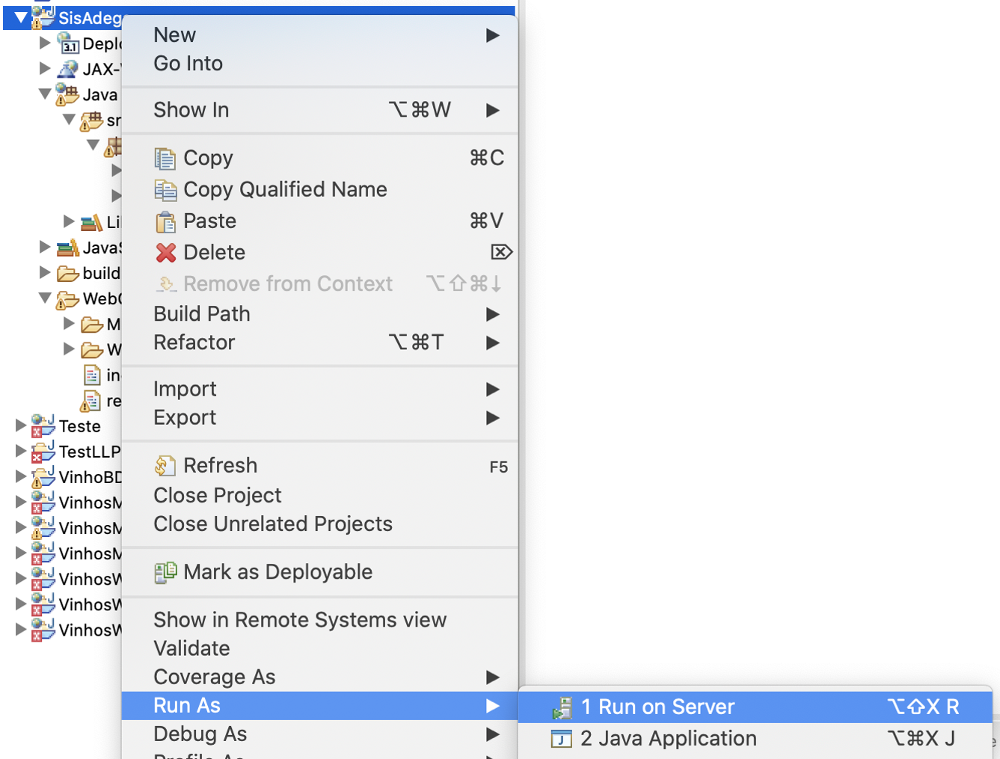  
Figura 64.13: Executando o projeto

Confirme que o Tomcat que configuramos está selecionado e marque o checkbox ***Always use this server when running this project***. Em seguida, clique no botão **Finish**:

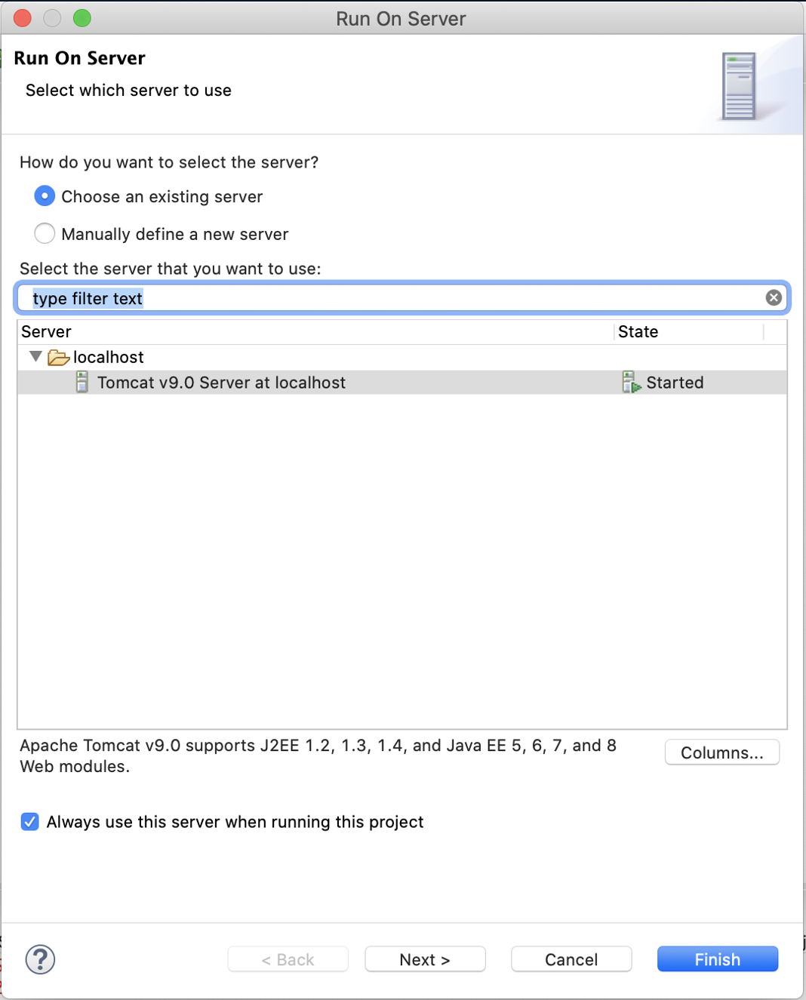  
Figura 64.14: Executando o projeto

O Tomcat será iniciado e você verá diversas mensagens na aba **Console** escritas em vermelho. Não se preocupe que não é nenhum erro, mas sim a cor utilizada pelo Tomcat como padrão no Eclipse. Após alguns segundos, finalmente, você verá que o servidor foi iniciado com sucesso:

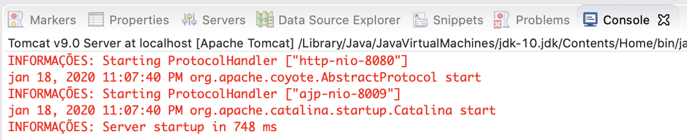  
Figura 64.15: Console da execução do projeto

A página exibida no próprio Eclipse será a seguinte:

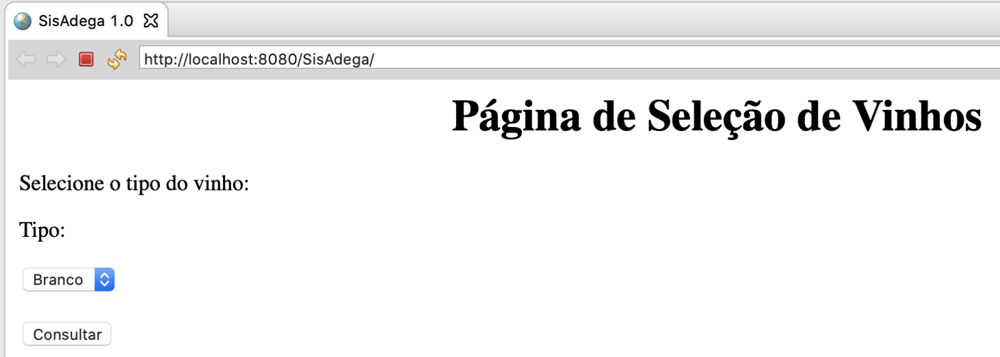  
Figura 64.16: Aplicação executada

Navegue à vontade na sua aplicação e desfrute da recomendação de vinhos! Se preferir, execute a aplicação (com o Tomcat inicializado) diretamente do seu browser, digitando o endereço **http://localhost:8080/SisAdega/**.

Neste capítulo, aprendemos a criar uma aplicação web simples usando apenas HTML, Java, Servlet e JSPs. Na prática, você provavelmente irá trabalhar com aplicações com regras de negócio mais complexas, e terá no seu projeto diversas classes com códigos mais avançados. Muito provavelmente, como já mencionamos, você não trabalhará diretamente com Servlets e JSPs, mas sim com *frameworks* de mercado - como o Spring MVC - que, apesar da elevada curva de aprendizagem inicial, facilitam muito a criação e a manutenção de aplicações web. Entretanto, conhecer o que acontece por trás dos panos - Servlets e JSPs - é essencial para aprender os *frameworks* mais avançados. Bons estudos!
